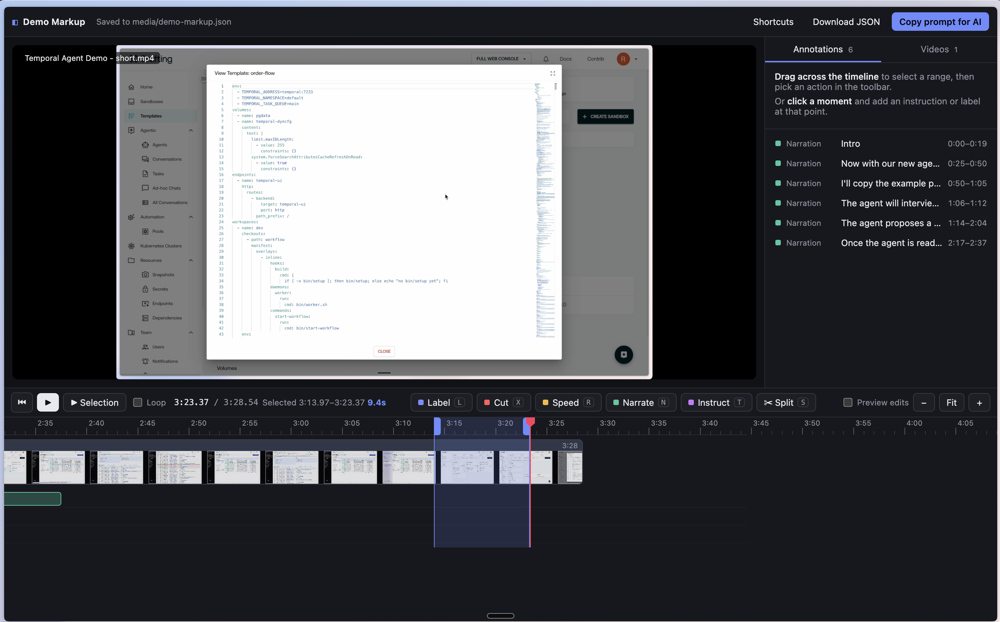

# Demo Markup

Mark up your screen recordings, then let an AI agent (Claude Code, Codex, etc.) edit them into a demo video.

Line up clips on a timeline, select parts, and add notes: label, cut, speed up, narrate, or any instruction. The notes are saved as `demo-markup.json` next to your videos. Everything runs locally.



## Install

Tell Claude Code:

```
Install and run https://github.com/rkirkendall/demo-markup
```

## Autopilot

Autopilot makes the video with you. It watches your recordings, asks what you want, shows you a draft, and keeps
iterating. Every edit shows up in the editor as a suggestion you can accept or reject.

Install it as a Claude Code plugin:

```
claude plugin marketplace add rkirkendall/demo-markup
claude plugin install demo-markup@demo-markup
```

Then start Claude Code in the folder with your recordings and say:

```
Run autopilot on these recordings. My demo script is at script.md.
```

It needs a [Gemini API key](https://aistudio.google.com/apikey) to watch the video, and an
[ElevenLabs](https://elevenlabs.io) key for narration. It will tell you how to add them. Your taste is kept in
`~/.config/demo-markup/style.md` and grows as you correct it.

## License

MIT
